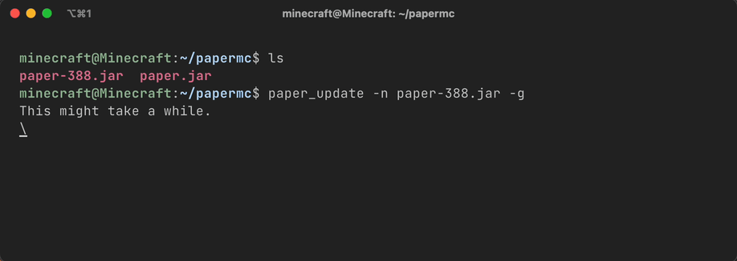

# YAPManTool -- Yet Another Paper Management Tool
A set of shell scripts for managing and updating a PaperMC server.

Currently only the updater is done and functional.

**I'm by no means a guru at this, so please report any flaws and provide suggestions. Thanks**

**Guarantee you'll find a bug or something broken, an oversight, etc. I'm still learning to write software and scripts.**

# YAPManTool Updater -- paper_update
Updates Paper using supplied version and build information via the PaperMC API v2

Requires: bash, curl, wget, jq, and GNU coreutils (or BSD userland, such as shasum on macOS).

On macOS, it's recommended to use brew to install newer bash (and other utilities).

Tested for Linux (including WSL2!) and macOS. This script will only work 100% correctly in bash.

Note: This does not check if Paper is running and will overwrite your Paper JAR if you force '-f' it.

What can YAPManTool Updater do?
- download a specific version and build via the API or the newest by default if no options are supplied
- verifies download is not corrupted by comparing SHA256 of local copy with the API, it will show an error otherwise (will not delete 'corrupt' JAR automatically)
- list available Paper versions that can be obtained via the API
- list the five most recent Paper builds (defaults to newest if -u is omitted) with respective commit hash and changes summary, just as listed on papermc.io
- find build number for a given JAR by comparing SHA256 hashes with the API (I will speed this up later.)

